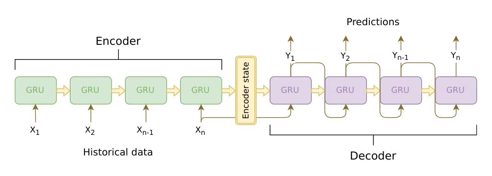
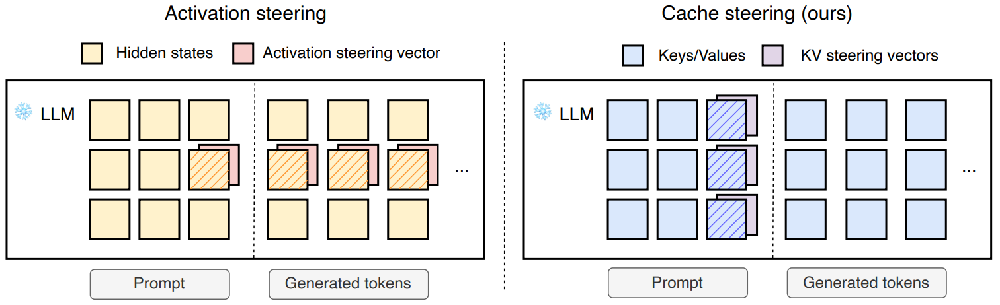
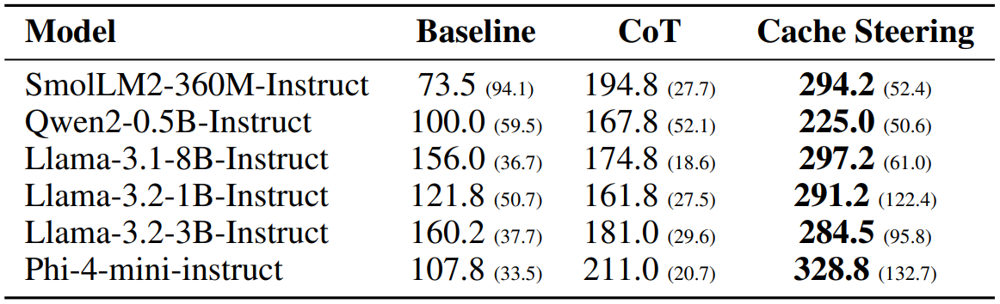
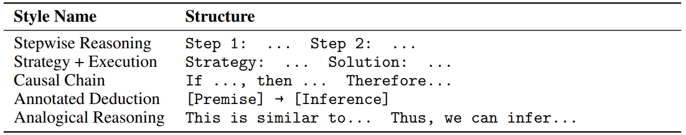

# 小規模言語モデルにおける推論誘導のためのKVキャッシュステアリング
元論文
> https://arxiv.org/abs/2507.08799 \
> https://arxiv.org/pdf/2507.08799

## Task
- 大規模言語モデルと小規模な言語モデルの互換性をどう取っているのか、特徴量ベクトルをどうしているのか
- 事前知識の部分のAttensionの式が何をしているのか
- Key/Value/Queryのテンソルはどうなっているのか

## TL;DR
- 推論時にKVキャッシュをワンショットで変更することでモデル挙動を制御する技術。
- 既存の活性化ステアリングと比べて、オーバーヘッドが少なく、出力も安定。
- 大規模モデルから推論スタイルを蒸留し、調整なしで小型モデルへ転移可。

## 概要
KVキャッシュに直接ワンショットで適応される「**キャッシュステアリング**」を提案。\
$\rightarrow$ 思考連鎖推論の為

GPT-4oの推論トレースを活用して、多段階推論へ導く誘導ベクトルの作成。\
微調整やプロンプトの変更は無し。

KVキャッシュ(キーバリューキャッシュ) … 短期記憶のようなもの。
> https://jp.micron.com/about/blog/company/insights/from-buzzword-to-bottom-line-understanding-the-why-behind-kv-cache-in-ai

## はじめに
モデルの内部隠れ状態を直接変更し、挙動を導く**活性化ステアリング**。\
有用であるものの、デコードプロセス全体を通して、各トークン生成ステップで**継続的な介入**が必要な場合が多い。\
この操作が**不安定性**を生じさせ、ハイパーパラメータ選択を極めて敏感に生成品質を落としかねない。

本研究では、キャッシュステアリングを導入。\
$\rightarrow$ TransformerモデルのKVキャッシュを直接、1度の修正を行うことで動作。

GPT-4oの様な高性能なモデルのステアリングベクトルを小型モデルのKey/Value表現に使うことで、推論軌道を誘導。\
トークン生成前の1度の処理で適用されるため、簡潔に明示的な多段階推論に誘導。

### 利点
- 従来の活性化ステアリングと比べ、ハイパーパラメータが安定/頑健
- 推論時のオーバーヘッド削減
- 標準的なTransformerでは容易に統合可
- 各ベンチにおいて、精度の上昇
  

ステアリングベクトル … 信号処理、特に音源分離において、ビーム方向(音を強調する方向)を決定するベクトル\
　　　　　　　　取り出したい音源方向のステアリングベクトルと信号の行列積より、強調可
> https://nettyukobo.com/beamformer/

## 関連研究
### 推論と思考の連鎖プロンプティング
プロンプト内で段階的な推論プロセス(思考の連鎖: CoT)を含む問題を示す方法(文脈内学習: ICL)がある。\
これを、小例学習プロンプティングという。
- CoTプロンプティングのゼロショット変種 $\rightarrow$「段階的に考えよ」等指示を追加し、簡略化できる

上記の知見では、
1. 言語モデルでCoT推論を単に誘発するだけでは不十分
2. 推論の様式が重要

よって、キャッシュレベルの介入により、大規模言語モデルさながらの推論行動への誘導を目指す。
  

CoT(Chain of thoughts)
> https://www.ibm.com/jp-ja/think/topics/chain-of-thoughts

ICL(in-context learning) … 少数の入出力のペアに基づいて、新しい入力に対して答えを推論
> https://www.anlp.jp/proceedings/annual_meeting/2024/pdf_dir/P9-14.pdf

### 活性化ステアリング
線形介入を通じて、デコード中の中間層の活性化を操作し、LLMの生成プロセスを暗黙的に制御する技術。\
再学習無しでモデルの行動を誘導/抑制できるために利用できる。

活性化ステアリングの流れは、
1. ベクトル抽出
2. 推論時のモデル活性化へのベクトル注入

ベクトル抽出では、ステアリングベクトルを計算。\
ポジティブプロンプト$p^+$とネガティブなプロンプト$p^-$から活性化を集約、対照セット$C$を作成。
$$C = {(p^+_0, p^−_0),(p^+_1, p^−_1), ...,(p^+_N , p^−_N)}$$
最も一般的な集約手法のDifference-in-Means(Wehner et al., 2025)を使う。\
ベクトルがペア化されている場合には平均差と同一 :
$$s_l = \frac{1}{N} \sum_{(p^+,p^−)∈C} f_l(p^+) − f_l(p^−)$$
- $f_l$は層$l$におけるTransformerモデルの一部
- $N$は対照データセット$C$内の例の数

推論中に、特定の層の活性化関数にステアリングベクトルを加算
$$h^*_l = h_l + c s_l$$
- $h_l$は、ステアリング前の層$l$における活性化関数
- $s_l$は、層$l$から抽出されたステアリングベクトル
- $c$は、ステアリングの強さを決定する係数\
 $c$の値を決定するには、グリッド検索一般的にを行う
  

活性化ステアリング (Activation steering) 元論文
> https://arxiv.org/html/2308.10248v5

Difference-in-Means (DiM) … 両クラスの平均値を単純に計算し、正の値から負の値を引く手法\
　　　　　　　　　　　　　負例を正例に一致させるベクトルを特定するのに最適。
> https://arxiv.org/html/2502.19649v3#S4

平均差 … データの中の2つの単位の値の差の絶対値を、全データに渡って総平均したもの
> http://www.wwq.jp/stacalcul2/meandeff.htm

### キャッシュ操作
本研究では使用されていないが、\
生成前のステップで、KVキャッシュを拡張する手法もある。

また、KVキャッシュのメリットは、
- メモリの使用量の削減
- コンテキスト表現の圧縮 (圧縮出来るのが何故嬉しいのか不明)
  

コンテキスト … データが**意味づけ**され情報になり、複数の情報から特定の目的下で**関連付け**られたもの
> https://zenn.dev/caphtech/articles/ai-context-making-foundations#1.-%E3%80%8C%E3%82%B3%E3%83%B3%E3%83%86%E3%82%AD%E3%82%B9%E3%83%88%E3%80%8D%E3%81%AE%E6%AD%A3%E4%BD%93%EF%BC%9A%E5%8D%98%E3%81%AA%E3%82%8B%E6%83%85%E5%A0%B1%E3%81%8B%E3%82%89%E6%84%8F%E5%91%B3%E3%81%AE%E3%81%82%E3%82%8B%E6%96%87%E8%84%88%E3%81%B8

## キャッシュステアリング
### 事前知識
Transformerベースのモデルでは、
- Query/Key/Valueのベクトル集合に対する自己注意機構に依存
- 文脈化されたトークン表現を計算

入力シーケンスに対して、層$l$の注意機構の出力は、
$$Attention(Q^l, K^l,V^l) = softmax \bigg(\frac{Q^l (K^l)^⊤}{\sqrt {D_h}} \bigg) V^l$$
ただし、$Q^l, K^l,V^l ∈ R^{T×H×D_h}$は層$l$における Query/Key/Value のテンソルであり、
- $T$はシーケンス長
- $H$はアテンションヘッド数
- $D_h$は各ヘッドの次元数

自己回帰的デコード中に、モデルが処理済みトークンに対応する$K^l$と$V^l$を保存。\
これがKVキャッシュ。

シーケンス全体の表現を再計算せずに、各新規トークンへの注意を効率的に計算可。\
このキャッシュは再利用可能であり、反復推論等のシナリオで有効。

テンソル … 多次元配列のこと

自己回帰的デコード(autoregressive decoding) … 前のステップを元にデコードする方法。

> https://qiita.com/m3yrin/items/7a6df0d7f5d44f0b5efc#auto-regressive%E3%81%A7left-to-right%E3%81%AA%E3%83%86%E3%82%AD%E3%82%B9%E3%83%88%E7%94%9F%E6%88%90

### KVステアリングベクトルの抽出
活性化ステアリング同様に、対照的なプロンプトのペア$C = \{ (p^+_0, p^-_0), (p^+_1, p^-_1), …, (p^+_N, p^-_N) \}$を構築。\
望ましい挙動をするプロンプトを**正例**、該当しないプロンプトを**負例**とする。\

対照的な例ペアごとに順伝播(Forward Pass)を行い、指定されたトークン位置の Key/Value のベクトルを抽出。\
差の平均法を用いてベクトルを集約。
$$
S^k_l = \frac{1}{N} \sum_{(p^+, p_-) \in C} f_l(p^+) - f_l(p^-) \\
S^v_l = \frac{1}{N} \sum_{(p^+, p_-) \in C} f_l(p^+) - f_l(p^-) 
$$
- $f_l$はTransformer層
- $S^k_l, S^v_l \in R^{H \times D_h}$は層$l$のステアリングテンソル
- $H$はアテンションヘッドの数
- $D_h$はアテンションヘッドの次元数

正例と負例の差分を取り、平均化することで
1. 個々の例から生じるノイズの最小化
2. 目標とする挙動に関連する方向性を含む信号を抽出

### KVステアリングの適用
推論時、入力プロンプトに対して一般的な順伝播を実行し、KVキャッシュを埋める。\
その後、各層$l$において、KVキャッシュ内のターゲットとなるトークン位置に対応するキャッシュ済み Key/Value ベクトルを修正
$$V^*_l = V_l + c^v S^v_l$$
$$K^*_l = K_l + c^k S^k_l$$
- $K_l, V_l ∈ R^{H×D_h}$ は層$l$の元のキャッシュ Key/Value ベクトル
- $S^k_l, S^v_l ∈ R^{H×D_h}$ はステアリングベクトル
- $c^k, c^v ∈ R$ はステアリング強度を制御するスカラー係数

### 直観
従来の活性化ステアリングと異なる点は、以下の3つ
1. Query 変更なし\
 通常の活性化ステアリングは、Query/Key/Value を生成する隠れ状態を変更する。\
 キャッシュステアリングは、Key/Value のみを変更する。\
 これにより、デコード時に入力文脈のより正確な表現を維持できる。

2. 過去の操作 vs 現在の操作
 - 通常の活性化ステアリングは、加えた変更が後の全ての隠れ状態に伝播。\
 オーバーステアリングと言い、介入後の生成品質に悪影響を及ぼす。
 - キャッシュステアリングは、将来のクエリによって直接注目。

3. 元の操作との整合性
ステアリングベクトルをCoT推論トレースを含むプロンプトの Key/Value から抽出。\
$\rightarrow$ 推論時にこれを適応することで、明示的な例を含めることなく小例学習プロンプティングの様な効果を期待。

### 実装の詳細

- 対照的セットの構築\
ステアリングベクトルの抽出用に、対照的データセットを作成。\
肯定的(CoTを生む)/否定的(出力のみを生む) なプロンプトのペアで構築。\
$\uparrow$ 推論ステップの有無が1番の違い

- 抽出と適応位置\
プロンプトの最終トークンから Key/Value のベクトルを抽出。\
通常は、生成プロンプトの採集トークンから抽出。\
\
推論時は、抽出したプロンプト内の同一位置にキャッシュステアリングを適用。\
ただし、自己回帰的デコード機構により、KVキャッシュは各トークンの処理後にのみ更新。\
また、位置合わせの為に、プロンプトに中立オフセットトークン(改行/空白)を追加。\
$\rightarrow$ 意図した位置に、キャッシュステアリングが影響することを保証。

- ハイパーパラメータ
KVキャッシュステアリングにおいても、Key/Value ベクトルのステアリング強度係数はハイパーパラメータ。\
大きなモデルから推論行動を蒸留する事に関心があるため、対照ペアの数と各ペアの文脈内の例の数もハイパーパラメータ。

モデルとデータセットのペアに対して、ハイパーパラメータは
- 小規模なグリッド検索を行い、妥当な値を取る。
- ステアリング強度係数は、タスク間で一貫した範囲内に収まる傾向

グリッド検索 … ハイパーパラメータの候補値を設定 $\rightarrow$ ハイパーパラメータの組み合わせを変えて学習 $\rightarrow$ モデルの評価 の流れでハイパーパラメータを最適化する手法
> https://shoblog.iiyan.net/grid-search/#st-toc-h-3

## 実験のセットアップ
### 評価用のベンチマーク
| Bench | Made by |
| --- | --- |
| GSM8K | Cobbe et al |
| CommonsenseQA | Talmor et al |
| ARC-challenge | Clark et al |
| PIQA | Bisk et al |

### モデル
| Model | Parameter (B) |
| --- | --- |
| Llama3.2 | 1 / 3 |
| SmolLM2 | 0.36 |
| Qwen2 | 0.5 |
| Phi-4-mini | 3.8 |
| Llama-3.1 | 8 |

### デコード戦略
キャッシュステアリングは、内部表現に影響を与え、出力ロジットをシフトさせる。\
よって、決定論的デコード/確率的デコードの両方で評価

サンプリングベースのデコードは、5つの異なるシードで応答を生成。\
各ベースライン生成と比較して、ステアリング効果の一貫性を評価
  

決定論的デコード … 貪欲法の様な確率値によって決定的に次の単語が選択されるデコード方式。
> https://zenn.dev/rk_tech/articles/18f5fe59c7b220#greedy-search%EF%BC%88%E8%B2%AA%E6%AC%B2%E6%B3%95%EF%BC%89

確率的デコード … サンプリングの様な条件付き確率分布によってランダムに次の単語が選択されるデコード方式。

サンプリングベース … 確率分布の中からランダムに1つの単語をサンプリングして、出力にランダム性を持たせるデコード方式。
> https://zenn.dev/rk_tech/articles/18f5fe59c7b220#sampling

### 回答抽出と評価指標
回答の正誤判定は、各タスク固有のヒューリスティックを用いる。

ヒューリスティック … 必ず正しい解ではないが、準最適解を得ることができる方法
> https://ja.wikipedia.org/wiki/%E3%83%92%E3%83%A5%E3%83%BC%E3%83%AA%E3%82%B9%E3%83%86%E3%82%A3%E3%83%83%E3%82%AF

### 活性化ステアリングとの比較
最も普及している活性化ステアリングの手法であるCAA法と比較。

CAA法 … 正負のペアから作ったステアリングベクトルを推論中の残差ストリームに足し引き。\
　　　　高次のふるまいを連続量で調整。
> https://zenn.dev/arai0711/articles/caa_steering_vectors_blog#%E6%89%8B%E9%A0%86%EF%BC%88%E8%B6%85%E8%A6%81%E7%B4%84%EF%BC%89

## 実験
表1. 4つの推論ベンチの各手法の比較。
貪欲法(左)とサンプリング(右)の両方のデコード手法で評価。
キャッシュステアリングが一貫して推論性能を向上。
更に、CoTプロンプティングを使用することで、さらなる性能向上が得られるケースが半数以上。

表2. 生成トークンの平均数。
キャッシュステアリングは一貫して生成出力の長さを増加させる。

  

図2. ARC-c & llama-3.2-1B-Instruct におけるキャッシュステアリングの解析。
対照データセットの大きさや Key/Value ステアリングの強さに関わらず、精度が安定。
文脈内例が少ない場合は、ノイズが減少しステアリング効果が増加。
幅広いハイパーパラメータに対して頑健。

図3. オーバーヘッドの比較。
単一のH100 GPU上での各手法のトークンあたりの平均時間(ms)。
継続的な介入を必要とする活性化ステアリングと比べて、キャッシュステアリングは無視できる程度のオーバーヘッドしか存在しない。

### スタイル転送
キャッシュステアリングが教師モデルから異なる推論スタイルを抽出できるかを検証。\
以下の表3の様に、正しい同一の答えに至るが、構造の異なる6つの推論トレースを使う。\
結果としては、段階的/類推的推論や因果連鎖であれば正しい構造を誘導可。\
戦略+実行では、過度なステアリングによるループ(e.g. Strategy:, Strategy:, …)、
注釈的推論では、ステアリングの過小またはによる過大論理的展開を書いた出力が発生。

表3. スタイル転送実験で使用された推論スタイルの概要。
上から、段階的推論/戦略+実行/因果連鎖/注釈付き推論/類推的推論。Premise(前提)

表4. 各スタイルのベクトルを用いて誘導した場合に、意図した構造を示す生成出力の割合。

## 注意点
キャッシュステアリングにも限界があり、
1. 小規模なモデルに焦点
2. どこまで一般化が可能か
3. 一般化に合わせた拡張の為に要研究

