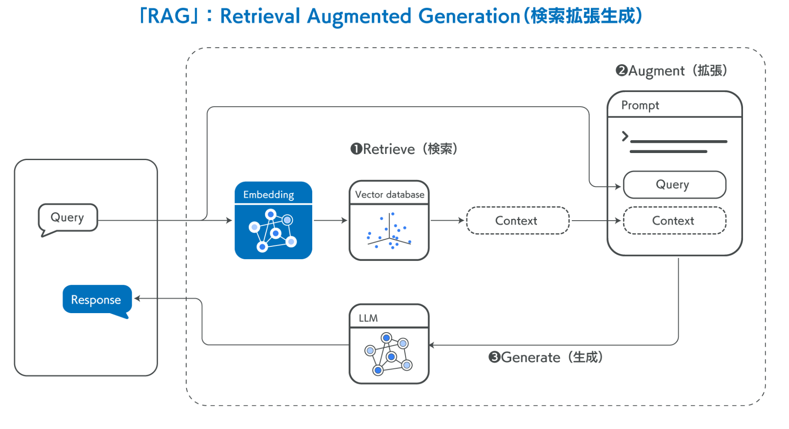
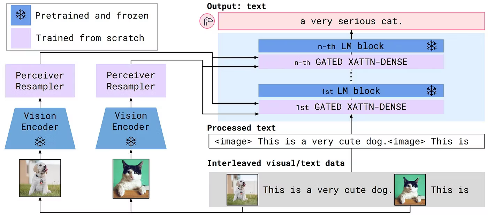

# RAG
## RAGとは何か
RAG(Retrieval-Augmented Generation)は、以下の流れで行われる**事前学習していない外部知識を検索して、その情報に基づいて文章を生成する手法**。
1. クエリを埋め込み表現にして、類似する情報をデータベースから検索。
2. 得られたコンテキストをプロンプトに追加。
3. LLMにプロンプトを入力し、推論。

図1. RAGの流れ

埋め込み表現(Embedding) …  単語や文章をベクトルに変換する操作

## 参考文献
RAGの概要【入門者向けの基礎知識】｜サクッと始めるRAG開発【LangChain / Python】
> https://zenn.dev/umi_mori/books/llm-rag-langchain-python/viewer/what-is-rag

■技術解説■ 生成AIのハルシネーションを低減するRAG。図表データまで特定できる"企業向けRAG"とは？（前編）
> https://blog-ja.allganize.ai/allganize_rag-1/

 

# Frozen Model
## AutoRAG-LoRAより
> 実装では、凍結モデルのトークンとソフトマックス関数を使って
> $$P_{ret}(y) = softmax(f_{frozen} (x^′, D))$$

上記のように定数でない関数のように扱われている。

## Frozen Modelとは何か
Frozen Model/LLMとは、LLMのパラメータを固定したモデル/LLMのこと。\
理由が不明なものの、画像を使うマルチモーダルなLLMに凍結モデルを使うことがある。

図1. マルチモーダルなLLMの1つである、Flamingoのアーキテクチャ

 

NTTドコモソリューションズ | エバンジェリストが語るICTの未来 | 生成AIの里 第四回：Promptがうまく言えなくて。。。：Pronto？Llama3、アンモナイトについて教えて！
> https://www.nttcom.co.jp/evangelist/column/kawamae_14/#section2

マルチモーダルLLMを理解する #生成AI - Qiita
> https://qiita.com/Dataiku/items/3e86c8012b2a7a7a3cf0#%E3%83%9E%E3%83%AB%E3%83%81%E3%83%A2%E3%83%BC%E3%83%80%E3%83%ABllm%E3%81%AE%E3%82%A2%E3%83%AB%E3%82%B4%E3%83%AA%E3%82%BA%E3%83%A0
