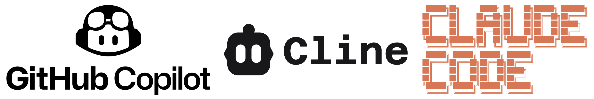

<!-- 下書き -->

<!-- タイトル/学科/氏名/指導教員名/発表日 etc -->
# 大規模言語モデルによるソフトウェア脆弱性の検出

<br/>

高知大学
理工学部情報科学科
横川武典

---

<!-- コード生成が話題となっているが、脆弱なコードを生成してしまう問題点がある -->
<!-- また、依然として脆弱性をついた攻撃は脅威であるため、LLMを使って早期に発見してしまいたい -->
<!-- https://www.ipa.go.jp/security/10threats/10threats2025.html -->

<br/>

## 1. 研究背景

言語モデルがコード生成やデバッグ等に活用
$\rightarrow$ 生成されるコードの**安全は担保されていない**

<br/>



<div class='center'>図1. コーディングに使われる言語モデルが含まれるツールの例</div>

--- 

<!-- ソースコードを入力として与えて、脆弱な部分を探したい -->
## 2. 研究目的
言語モデルで脆弱性を**自動で検知**
以下2つの問題に対応可能
1. 言語モデルが生成したコードは**安全と限らない**
$\rightarrow$ コードに自動で脆弱性の検知を行い安全性を確保
2. 脆弱性を発見には**テスト**や**コードレビュー**が必要
$\rightarrow$ 手間の削減が可能

---
<!-- github copilotには該当する機能に似たものはありそう -->
<!-- https://docs.github.com/ja/copilot/tutorials/copilot-chat-cookbook/analyze-security/find-vulnerabilities -->
<!-- LLMを使ったソフトウェアの脆弱性検出手法の調査 -->
<!-- https://arxiv.org/html/2502.07049v2 -->
## 3. 関連研究
LLMs in Software Security: A Survey of Vulnerability Detection Techniques and Insights

**特定のコードの断片**からは、脆弱性を検出できる言語モデルが存在
**リポジトリ**からなるアプリケーションでは、限定的な脆弱性の検出のみ可能
> https://arxiv.org/html/2502.07049v2

---

<!-- 脆弱性をjsonで取得しRAGを作成したり、FTしたりして脆弱な部分を探せないか試していく -->
## 4. 研究手法
脆弱性のデータベースを取得
このデータベースを参照/学習に使い脆弱性を発見可能にする
1. 脆弱性のデータベースを取得/作成
2. データベースを元に**RAG**の作成/**FineTuning**を行う
3. ソースコードから脆弱性を探す

---

<!-- RAGの概念的な説明 -->
<!-- https://aws.amazon.com/jp/what-is/retrieval-augmented-generation/ -->
### RAGとは


---

<!-- FTの概念的な説明 -->
<!-- https://www.ibm.com/jp-ja/think/topics/fine-tuning -->
### FineTuningとは


---

<!--  -->
## 5. 実験計画


---

<!-- WordPressの脆弱性をjsonで取得 -->

<!-- gpt-oss-20bに脆弱そうに見えるphpのコードを入力したら出力が正常でなくなってしまった  -->
<!-- →言語モデルの性能に対して、長い入力となっているのが原因？ -->
<!-- 　https://note.com/ainest/n/n2fe8842f062e -->
<!-- 　https://arxiv.org/html/2402.14848v2 -->
<!-- 　→コーディング性能の高いQwen3-Coder_30b_A3Bを試してみる？ -->
## 6. 現状の進捗

### 6-1. データの取得

以下のサイトからWordPressに関する脆弱性を取得しjsonで保管
JVN iPedia - 脆弱性対策情報データベース
> https://jvndb.jvn.jp/

CVE: Common Vulnerabilities and Exposures
> https://www.cve.org/CVERecord

---

### 6-1. データの取得

以下にjson形式で集めたデータの一例を示す
このようなデータの集合から、**類似した脆弱性**を発見させる事が目標

<br/>

```
"JVNDB-2025-009951": {
  "title": "AntoineH の WordPress 用 Football Pool における…",
  "description": "The Football Pool plugin for WordPress is …",
  "technologies": "AntoineH Football Pool 2.12.5 未満"
  }
```
<div class="center"> 図2. 脆弱性データベースの一例 </div>

---

### 6-2. 脆弱性の発見

**調整していない言語モデル**に脆弱性を探させてみる
1. オンラインのモデルとして"chatGPT-4o mini"を利用
"chatGPT-4o mini"で生成したphp/pythonのコード全文を入力
$\rightarrow$ 
2. ローカル用モデルとして"gpt-oss-20b"を利用
"chatGPT-4o mini"で生成したphp/pythonのコード全文を入力
$\rightarrow$ 結果は**出力が不安定に**
　 $\rightarrow$ 入力長が長いことが原因

---

<!-- 安定した出力が得られる言語モデルを探す, FTまたはRAGに手を付ける, どれだけ脆弱性が探せるようになるか検証する -->
## 7. 今後の課題
1. 入力長が長くても安定した出力を得られる言語モデルを探す
2. 脆弱性情報を言語モデルに**FineTuning**
または**RAG**等で言語モデルが情報を参照可能に
3. どの程度の脆弱性を発見できるか調査
