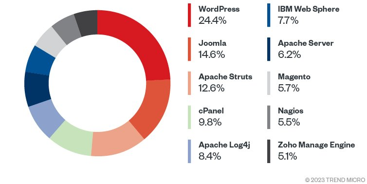

<!-- 下書き -->

<!-- タイトル/学科/氏名/指導教員名/発表日 etc -->

# 大規模言語モデルによるソフトウェア脆弱性の検出

#### 高知大学 理工学部情報科学科 横川武典

---

<!-- コード生成が話題となっているが，脆弱なコードを生成してしまう問題点がある -->
<!-- また，依然として脆弱性をついた攻撃は脅威であるため，LLMを使って早期に発見してしまいたい -->
<!-- https://www.ipa.go.jp/security/10threats/10threats2025.html -->

<br/>

## 1. 研究背景

言語モデルがコード生成やデバッグ等に活用
$\rightarrow$ 生成されるコードの**安全は担保されていない**

<br/>


<div class='center'>図1. コーディングに使われる言語モデルが含まれるツールの例</div>

--- 

<!-- ソースコードを入力として与えて，脆弱な部分を探したい -->

## 2. 研究目的
言語モデルで脆弱性を**自動で検知**
以下2つの問題に対応可能
1. 言語モデルが生成したコードは**安全と限らない**
$\rightarrow$ コードに自動で脆弱性の検知を行い安全性を確保
2. 脆弱性を発見には**テスト**や**コードレビュー**が必要
$\rightarrow$ 手間の削減が可能

---

<!-- github copilotには該当する機能に似たものはありそう -->
<!-- https://docs.github.com/ja/copilot/tutorials/copilot-chat-cookbook/analyze-security/find-vulnerabilities -->

<!-- "LLMを使う上で考えるべきセキュリティ"にも活用例がある -->
<!-- https://qiita.com/OmeGaNo1/items/d2ffef9417238a74a8f7 -->

<!-- LLMを使ったソフトウェアの脆弱性検出手法の調査 -->
<!-- https://arxiv.org/html/2502.07049v2 -->

## 3. 関連研究
#### LLMs in Software Security: A Survey of Vulnerability Detection Techniques and Insights [Ze Sheng+2025]

- **コードの断片**から脆弱性を検出できる言語モデルが存在
- **リポジトリ**単位では限定的な脆弱性の検出のみ可能
- メモリ関連の脆弱性は検出精度が高い
- C/C++に関する研究が多い

<!-- 図を追加 -->

---

<!-- 脆弱性をjsonで取得しRAGを作成したり，FTしたりして脆弱な部分を探せないか試していく -->

## 4. 研究手法
脆弱性のデータベースを取得
データベースを参照/学習に使い脆弱性を発見可能に

1. 脆弱性のデータベースを取得/作成
2. データベースを元に**RAG**の作成/**FineTuning**
3. ソースコードから脆弱性を探す

---

<!-- RAGの概念的な説明 -->
<!-- https://aws.amazon.com/jp/what-is/retrieval-augmented-generation/ -->

### RAG(Retrieval-Augmented Generation)とは
RAGは**事前学習していない外部知識を検索しその情報に基づいて文章を生成する手法**

<div class="split">
  <div class="split-item split-left">
  以下の3段階で機能する<br/>
  1. クエリと<strong>類似する情報</strong>を<br/>
  データベースから検索<br/>
  2. <strong>得られた情報</strong>をプロンプトに追加<br/>
  3. LLMにプロンプトを入力して推論<br/>
  </div>
<!-- 図を右に移動 -->
  <div class="split-item split-right">
    
  </div>
</div><br/><br/><br/><br/><br/>

---

<!-- FTの概念的な説明 -->
<!-- https://www.ibm.com/jp-ja/think/topics/fine-tuning -->

### FineTuningとは
既存の学習済みモデルに，**追加の学習を行い特定のタスク用に
調整する**手法
メリットは以下の3つ
1. 一から学習しないため**コストが安い**
2. 最新の情報への対応
3. 特定の用途に**特化したモデル**を作成可

---

<!-- 脆弱な言語/アプリといえばWordPressやphpだよねというバイアスから -->
<!-- よりよい/興味のあるプロジェクトがあればそちらに変えても良い(メンテナに放棄されているものならなお良し) -->
<!-- ただし，何もわからない言語は大変である(js等) -->

<!-- 計算資源の観点から見て特定の言語に絞ってしまって問題ない -->

<!-- この章を1ページないしは1+Appendixに収める -->

## 5. 実験計画
1. **脆弱性のデータベースを取得/作成**
以下の脆弱性の情報をまとめたデータベースを作成する
　1-1. 要約
　1-2. 内容
　1-3. 影響を受けるソフトウェア
2. **データベースを元にRAGの作成/FineTuning**
3. **ソースコードから脆弱性を探す**
　・ 既存のソースコード
　・ 言語モデルの生成したソースコード

---

<!-- WordPressの脆弱性をjsonで取得 -->

## 6. 現状の進捗

### 6-1. データの取得

脆弱性情報を管理する**JVN**/**CVE**から収集した脆弱性情報を元に
データベースを構築
**WordPress**に関する脆弱性を取得しjsonで保管
データベースを活用し，**脆弱性を発見すること**が目標

```
"JVNDB-2025-009951": {
  "title": "AntoineH の WordPress 用 Football Pool における…",
  "description": "The Football Pool plugin for WordPress is …",
  "technologies": "AntoineH Football Pool 2.12.5 未満"
  },
```
<div class="center"> 図2. 脆弱性データベースの一例 </div>

---

<!-- gpt-oss-20bに脆弱そうに見えるphpのコードを入力したら出力が正常でなくなってしまった  -->
<!-- →言語モデルの性能に対して，長い入力となっているのが原因？ -->
<!-- 　https://note.com/ainest/n/n2fe8842f062e -->
<!-- 　https://arxiv.org/html/2402.14848v2 -->
<!-- 　→パラメータ数と最大入力長にはある程度比例関係がありそうなので大きなモデルで試す -->
<!-- 　ex) Qwen3-Coder_30b_A3B -->

### 6-2. 脆弱性の発見

**調整していない言語モデル**に脆弱性を探させてみる
検証に使ったソースコードは"chatGPT-4o mini"で生成
1. オンラインのモデルとして"chatGPT-4o mini"を利用
生成したphpのコード全文から脆弱性を探す
$\rightarrow$ 簡単なコードの脆弱性は**検出/修正可**
2. ローカル用モデルとして"gpt-oss-20b"を利用
生成したphpのコード全文から脆弱性を探す
$\rightarrow$ 結果は**出力が不安定に** (入力長が長いことが原因)

---

<!-- 安定した出力が得られる言語モデルを探す, FTまたはRAGに手を付ける, どれだけ脆弱性が探せるようになるか検証する -->

## 7. 今後の課題
1. 入力長が長くても安定した出力を得られる言語モデルを探す
2. 脆弱性情報を元に言語モデルを**FineTuning**
または**RAG**等を作成し言語モデルが情報を参照可能に
3. どの程度の脆弱性を発見できるか調査

---

<!-- リンクはここに -->

## 参考文献

- [Ze Sheng+2025] LLMs in Software Security: A Survey of Vulnerability Detection Techniques and Insights\
 https://arxiv.org/html/2502.07049v2

- JVN iPedia - 脆弱性対策情報データベース\
 https://jvndb.jvn.jp/

- CVE: Common Vulnerabilities and Exposures\
 https://www.cve.org/CVERecord

---

## Appendix A. WEB言語の脆弱性の傾向

2022年に脆弱性が悪用された技術としてWordPressがトップ
全体の1/4を占めた

<div class="center">

</div>

--- 

<!-- RAG -->
<!-- https://qiita.com/yagiyanagi/items/bfff61dbd077eb391812 -->

<!-- FineTuning -->
<!-- https://www.codemajin.net/fine-tuning-llm-with-unsloth/ -->

## Appendix B. データベースからFineTuning/RAGを作成する手法
- RAGを作成する場合
**自然言語**で書かれた脆弱性のデータベースを**ベクトル**に変換
この処理はPythonの"LangChain"等のライブラリを使用

- FineTuningの場合
オープンソースで公開されている言語モデルに脆弱性の
データベースで**追加学習**
この処理はPythonの"unsloth", "trl"等のライブラリを使用
