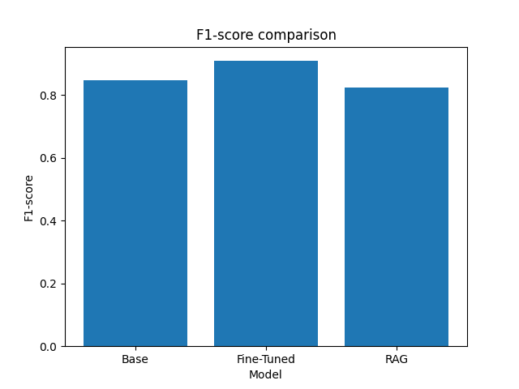
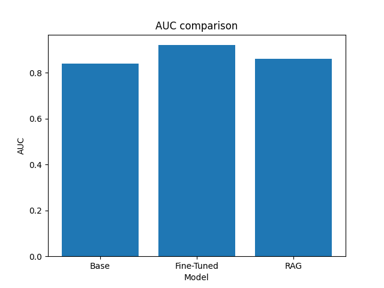

 

# 大規模言語モデルによるソフトウェア脆弱性の検出

#### 高知大学 理工学部情報科学科  
#### 木脇研究室
#### B4
#### 横川武典

---

## 1. 既存手法
**従来の脆弱性検出手法**は大きく2つある
- 実行せずコード解析
- 実行時の挙動解析

これらの手法では、**誤検知**や**検出漏れ**が発生

$\rightarrow$ 既存手法では**コード全体の文脈**を考慮した検出が困難

<!-- 図 -->

---

## 2. 関連研究 **[Ze Sheng+2025]**
- **コードの断片**から脆弱性を検出できる言語モデルが存在
- **リポジトリ**単位では限定的な脆弱性の検出のみ可能
- メモリ関連の脆弱性は検出精度が高い
- C/C++に関する研究が多い

 $\rightarrow$ **文脈理解**による検出手法として**言語モデルの活用**が期待

---

<!-- 要修正？ -->
## 3. 提案手法
**Web言語**を対象に**LLMの利用方法の違い**に着目して評価

1. 脆弱性の**データベース[JVN, CVE, RS]を取得/作成**
    - 脆弱性の報告: 19800件
    -  脆弱なコード: 750件
2. データベースを元に**RAG**の作成/**FineTuning**
3. 各モデルでソースコードから脆弱性を探す
$\rightarrow$ **chatGPT[chatGPT]** が生成したソースコード: 10件

---

### RAG(Retrieval-Augmented Generation)とは
RAGは**事前学習していない外部知識を検索しその情報に基づいて文章を生成する手法**

<!-- 図 -->

---

### FineTuningとは
既存の学習済みモデルに**追加の学習を行い特定のタスク用に調整する**手法

<!-- 図 -->

---

<!-- 要修正？ -->
## 4. 実験設定
- 対象 : **PHP**で記述されたWebアプリケーション

- LLM : `unsloth/Qwen3-14B-unsloth-bnb-4bit`[Qwen]
　 　 `intfloat/multilingual-e5-large`[e5]

- 比較対象 : 素のLLM 　 　　　　　　(以下**Base**)
 　 　 　 　FineTuningを行ったLLM (以下**FT**)
 　 　 　 　RAGを接続したLLM 　 　(以下**RAG**)

- 実験方法 : 各構成に同一コードを入力
　 　 　 　$\rightarrow$ 脆弱性の**検出結果を取得**

---

<!-- 要修正？ -->
## 5. 評価方法
脆弱性の検出結果を**指標**として数値化

- **Precision** : 脆弱性を**どれだけ正しく予想できたか**の指標

- **Recall** : 予測が**どれだけ正しかったか**の指標

- **AUC** : **閾値**に依存しない検出性能指標

---

<!-- Recall, Presicionについて述べる -->
<!-- 表の追加 -->
<!-- 図はわかりやすくする、縦軸の調整や横の点線 -->

  

    <h2>6. 実験結果</h2>
    図4より、F1-scoreは 
    <ul>
      <li><strong>FT</strong>が最も正しく検出</li>
      <li><strong>RAG</strong>は<strong>Base</strong>より悪化</li>
    </ul>
  

  

    
    
図4. F1-scoreの測定結果

  

          

---

<!-- 可能ならAUCのテーブルやROC曲線を追加 -->
<!-- 表の追加 -->
<!-- 図はわかりやすくする、縦軸の調整や横の点線 -->

  

    <h2>6. 実験結果</h2>
    図5より、AUCは 
    <ul>
      <li><strong>FT</strong>が最も検出性能が高い</li>
      <li>次点で<strong>RAG</strong>が高い</li>
    </ul>
  

  

    
    
図5. AUCの測定結果

  

          

---

### 誤検知の傾向
**Base** において多く発生、**RAG** でも一定数発生
- Baseでは文脈理解が不十分で脆弱性を**過剰**に指摘
- RAGでは**関連知識の誤適用**/**コンテキスト長の増加**が存在

**XSS** を検出するタスクで多く発生
- 過剰に出力をエスケープ
 $\rightarrow$ **文脈を理解した検出**は不十分

---

### 検出漏れの傾向
**Base** において多く発生
-  文脈理解が不十分なまま安全側に判断

**FT / RAG** では脆弱性知識の獲得により改善
- ただし完全には解消されず

---

## 7. 結論

LLMはWebアプリケーションの脆弱性検出に**活用可能**
ただし**利用方法により検出性能は大きく異なる**

- FTは**検出精度の安定化**に有効
- RAGは**知識依存度の高い脆弱性**で効果を示した

$\rightarrow$ 利用方法の違いが検出性能に影響することを確認

---

## 8. 今後の課題
- より大規模・多様なコードでの検証
- 脆弱性検出結果の**根拠や判断理由の可視化**
- 誤検知パターンの**体系的分析**

---

## 参考文献

- [Ze Sheng+2025] LLMs in Software Security: A Survey of Vulnerability Detection Techniques and Insights\
 https://arxiv.org/html/2502.07049v2

- [Qwen] unsloth/Qwen3-14B-unsloth-bnb-4bit\
https://huggingface.co/unsloth/Qwen3-14B-unsloth-bnb-4bit

- [e5] intfloat/multilingual-e5-large\
https://huggingface.co/intfloat/multilingual-e5-large

---

- [chatGPT] ChatGPT\
 https://chatgpt.com/ja-JP/overview/

- [JVN] JVN iPedia - 脆弱性対策情報データベース\
 https://jvndb.jvn.jp/

- [CVE] CVE: Common Vulnerabilities and Exposures\
 https://www.cve.org/CVERecord

- [RS] rules.sonarsource.com\
 https://rules.sonarsource.com/php/

---

## Appendix A. WEB言語の脆弱性の傾向

2022年に脆弱性が悪用された技術としてWordPressがトップ
全体の1/4を占めた

---

<!-- LLMがセキュリティ分野においてどう使われているかを書く -->
## Appendix B. セキュリティ分野でのLLMの活用
言語モデルは**セキュリティ関連タスク**に既に活用

- **脆弱性の説明・要約**
  - 脆弱性レポートやアラートの理解支援
- **脆弱性検出**
  - コードの文脈を考慮した指摘が可能

$\rightarrow$ **言語モデルの出力の信頼性**が重要
　 特に脆弱性検出では**誤検知・検出漏れが実運用に影響**

--- 

## Appendix C. データベースの活用方法

### FineTuningの場合
OSSの言語モデルに脆弱性のデータベースで**追加学習**
この処理は`unsloth`, `trl`等のライブラリを使用

### RAGを作成する場合
**自然言語**で書かれた脆弱性のデータベースを**ベクトル**に変換
この処理は`LangChain`, `LanceDB`等のライブラリを使用
ベクトル化には`infloat_multilingual-e5-large`を使用

